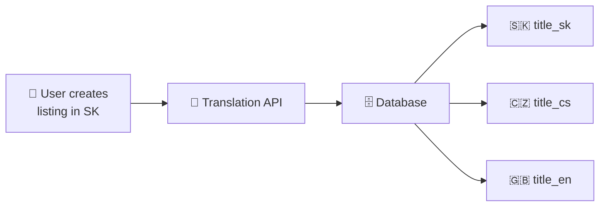
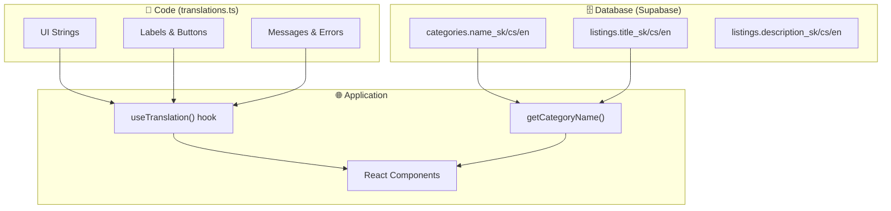

# Localization Architecture

> **Standard**: Hybrid Localization (Industry Best Practice for Marketplaces)

## Overview

Slovor Marketplace uses a **hybrid localization architecture** that combines:
- **Static UI strings** stored in code for performance
- **Dynamic content** stored in database for flexibility

This approach follows industry standards used by major platforms (Airbnb, eBay, Amazon).

---

## 🌟 Unique Feature: Auto-Translation

> **Unique Feature of Slovor Marketplace!**

When a user creates a listing in their native language, the system **automatically translates** it to all supported languages.



### Benefits:
- **For Sellers**: Create listing once — visible to buyers from different countries
- **For Buyers**: See all listings in their own language
- **For the Marketplace**: Effortless audience expansion

### Status: 🚧 In Development
- ✅ Database fields ready (`title_sk/cs/en`, `description_sk/cs/en`)
- ⏳ Translation API integration

---

## Architecture Diagram



---

## Content Classification

| Content Type | Storage | Example | Reason |
|--------------|---------|---------|--------|
| Navigation | Code | "Home", "Categories" | Static, rarely changes |
| Form Labels | Code | "Price", "Location" | Static, developer-managed |
| Error Messages | Code | "Invalid email" | Static, version controlled |
| **Category Names** | **Database** | "Electronics" | Admin-editable |
| **Listing Titles** | **Database** | User content | User-generated |
| **Listing Descriptions** | **Database** | User content | User-generated |

---

## Database Schema

### Categories Table
```sql
CREATE TABLE categories (
  id UUID PRIMARY KEY,
  name TEXT NOT NULL,        -- Default/fallback name
  name_sk TEXT,              -- Slovak translation
  name_cs TEXT,              -- Czech translation
  name_en TEXT,              -- English translation
  slug TEXT UNIQUE NOT NULL,
  -- ... other fields
);
```

### Listings Table
```sql
CREATE TABLE listings (
  id UUID PRIMARY KEY,
  title TEXT NOT NULL,           -- Primary title
  title_sk TEXT,                 -- Slovak translation
  title_cs TEXT,                 -- Czech translation
  title_en TEXT,                 -- English translation
  description TEXT,              -- Primary description
  description_sk TEXT,           -- Slovak translation
  description_cs TEXT,           -- Czech translation
  description_en TEXT,           -- English translation
  -- ... other fields
);
```

---

## Implementation

### 1. UI Strings (Code)

**File**: `lib/i18n/translations.ts`

```typescript
export const translations = {
  sk: {
    common: {
      home: 'Domov',
      categories: 'Kategórie',
      // ...
    },
    filters: { /* ... */ },
    createListing: { /* ... */ },
  },
  cs: { /* ... */ },
  en: { /* ... */ },
}
```

**Usage in components**:
```tsx
const { t } = useTranslation()
return <h1>{t.common.home}</h1>
```

### 2. Dynamic Content (Database)

**File**: `lib/utils/category-helpers.ts`

```typescript
export function getCategoryName(
  category: Category,
  locale: string
): string {
  // Priority: DB field → fallback to default name
  if (locale === 'sk' && category.name_sk) return category.name_sk
  if (locale === 'cs' && category.name_cs) return category.name_cs
  if (locale === 'en' && category.name_en) return category.name_en
  return category.name
}
```

---

## When to Use What

### ✅ Use Code (`translations.ts`) for:
- Navigation items
- Button labels
- Form field labels
- Validation messages
- Static page content
- Feature descriptions

### ✅ Use Database for:
- Category names (admin can update)
- Listing titles & descriptions (user-generated)
- Any content that needs CMS-like management
- Content that changes without code deployment

---

## Adding New Translations

### For UI Strings:
1. Add key to `lib/i18n/translations.ts` in ALL locales (sk, cs, en)
2. Use via `t.section.key` in components

### For Dynamic Content:
1. Add `{field}_sk`, `{field}_cs`, `{field}_en` columns to DB table
2. Update TypeScript interface in `lib/types/database.ts`
3. Update helper function to read localized field
4. Migrate existing data if needed

---

## Performance Considerations

| Approach | Performance | Use Case |
|----------|-------------|----------|
| Code translations | ⚡ Instant (in-memory) | UI strings |
| Database translations | 🔄 Requires query | Dynamic content |
| Cached DB translations | ⚡ Fast after first load | Frequently accessed dynamic content |

---

## Supported Locales

| Code | Language | Flag |
|------|----------|------|
| `sk` | Slovak | 🇸🇰 |
| `cs` | Czech | 🇨🇿 |
| `en` | English | 🇬🇧 |

Default locale: `sk`
